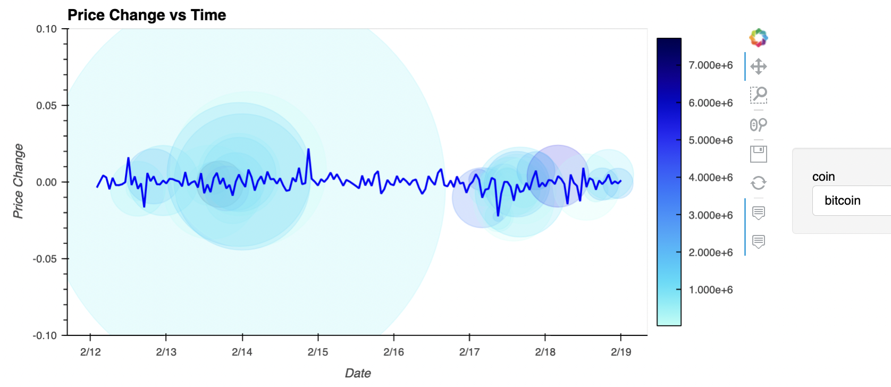
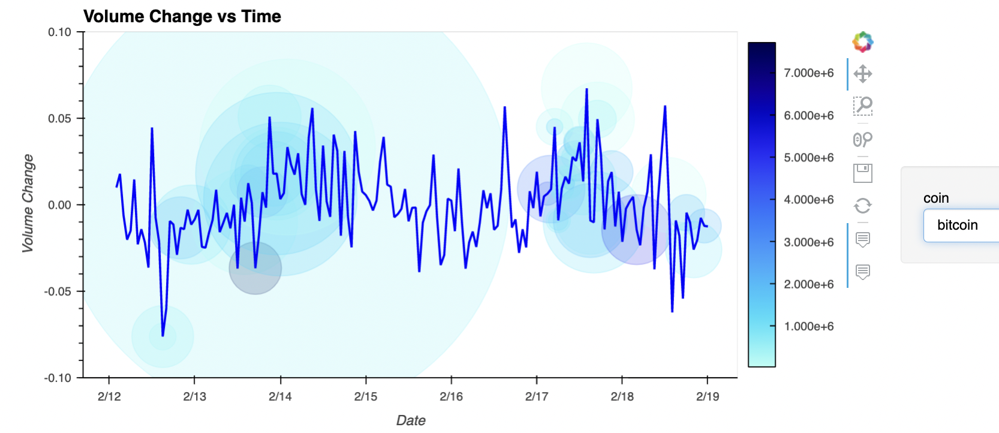
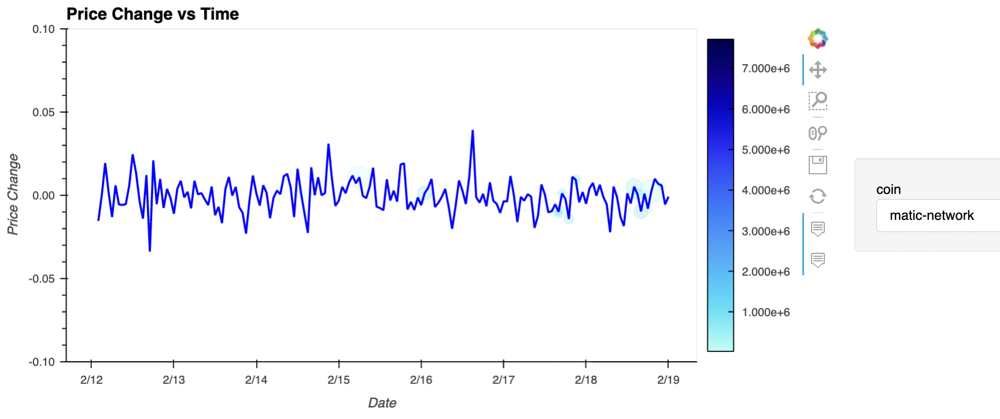
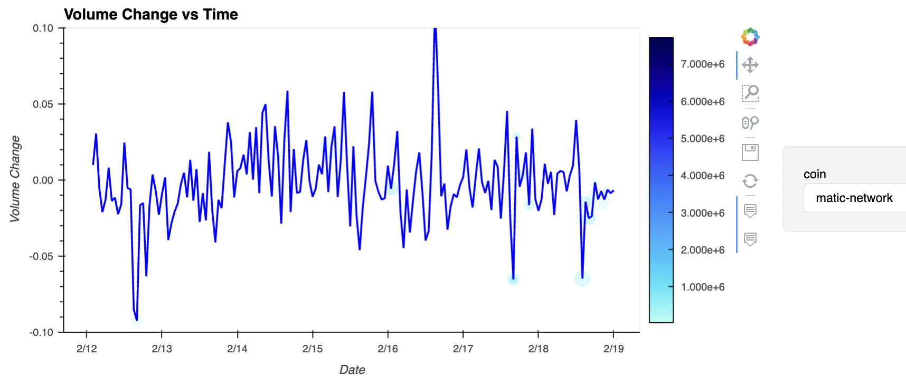

# Twitter's Impact on Cryptocurrency

### This is an application that aims to find correlations between Tweets and the price fluctuations of cryptocurrency.

Below are questions we would like to research:

1. How does Twitter impact cryptocurrency prices?

2. Should investors use Twitter to make financial decisions on crypto investments?

---

## Technologies

This project leverages python 3.9 and Jupyter lab notebook was used to run all analysis.

We used the following datasets to gather information:

- [CoinGecko API](https://www.coingecko.com/en/api/documentation) - it is an independently sourced collection of crypto data that includes metrics, such as live prices, trading volume, exchange volumes, trading pairs, historical data, contract address data, crypto categories, crypto derivatives, images and more.
- [Twitter API](https://developer.twitter.com/en/docs/twitter-api) - it is a set of programmatic endpoints that can be used to understand or build the conversation on Twitter. This allows you to retrieve, engage with, or create a variety of different resources including Tweets, users, spaces, direct messages, etc.
  - [Tweepy](https://docs.tweepy.org/en/stable/) - it is an open source Python library for accessing the Twitter API.

---

## Installation Guide

Before running the application first import the following libraries and dependencies.

Instsall Tweepy

```python
pip install tweepy
```

Install CoinGecko

```python
pip install pycoingecko
```

Imports

```python
import tweepy
from dotenv import load_dotenv
import os
import json
import pandas as pd
import hvplot.pandas
from datetime import datetime, timedelta
import time
from bokeh.models.formatters import DatetimeTickFormatter
from pycoingecko import CoinGeckoAPI
```

---

## Data Collection and Setup

Here are the criteria we used for this project:

- Timeframe: With Twitter's API limitations, we were only able to retrieve 7 days worth of data.
- Coins analyzed: Bitcoin, Ethereum, Solana, Litecoin, Ripple, Solana, Cardano, Polkadot, Shibainu, Dogecoin, Avalanche, and Matic

* Tweets: volume, likes, retweets, replies, and key words

To make the API calls, make sure to have your Twitter API Keys loaded, set the configurations for Tweepy, and set the CoinGecko variable.

- Dictionary of coins: set up dictionary to capture all search terms associated with each of the 11 coins and the queries per coin. Use this dictionary later to loop through both Twitter and CoinGecko dataframes.

---

**Data Collected from Twitter**

- Create a Twitter dataframe that captures the following:
  - The most popular 500 tweets within the past 7 days using Tweepy
  - Twitter data to collect:
    - Text of the tweet
    * Timestamp of the tweet
    - Tweet ID
    - Count of followers of account
    - Count of tweet likes
    - Count of retweets
    - Screenname

Make sure the dataframe is set to proper datetime format.

---

**Data Collected from CoinGecko**

- Create a CoinGecko dataframe that captures the following:
  - Timestamp
  - Price of coin
  - Market caps of coin
  - Total volume of coin
  * Percent change of price, total volume, and market caps

---

**Results: Combining Twitter and CoinGecko data**

In order to analyze Twitter's effects on crypto prices, we combined both dataframes into one large dataframe based on where the timestamps intersected at the nearest hour for each coin.

This allowed us to overly plots of both Twitter and CoinGecko activities grouped by each coin.

For instance, Bitcoin's Twitter activity and price change is displayed below:



Bitcoin's Twitter activity and volume change:



The blue circles represent Twitter activity and the blue lines indicate price or volume changes. In Bitcoin's case, even at times of significant Twitter activity, there was not always extreme price or volume fluctuations.

Here, you can also see Matic's price and volume changes according to Twitter activity:





In Matic's case, Twitter activity seems to correlate with its price and volume changes.

---

**Conclusion**

From the graphs above, the results have shown that Twitter has varying degrees of price movement of cryptocurrency. Specifically, the bigger, more established coins, such as Bitcoin, are less impacted by Twitter activity compared to smaller, less traded altcoins, like Matic.
